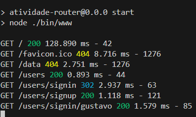

# Atividade Router

Repetir o exercício da aula anterior (Aula 6 Express) utilizando agora um Router.  Opcionalmente utilizar o express-generator para criar a estrutura básica.

Postar o link do Github como resposta.

